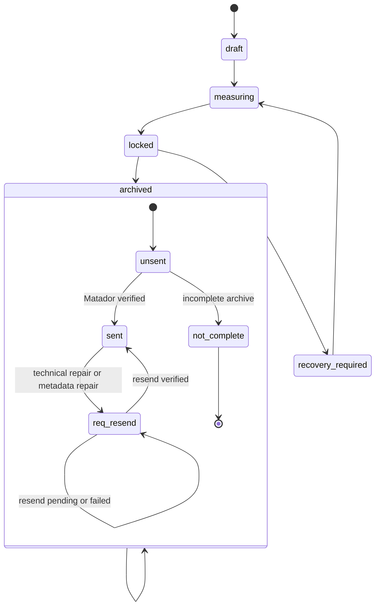

# Session State Machine

This file documents observable session/container statuses used by code and tests.

## Session State

Stored mostly in root H5 attrs:

```text
session_state
session_state_reason
session_state_updated_at
```

Common values:

```text
draft
measuring
locked
archived
recovery_required
```

## Transfer Status

Stored in root H5 attr:

```text
transfer_status
```

Canonical values:

```text
unsent
sent
req_resend
not_complete
```

UI display normalizes to uppercase:

```text
UNSENT
SENT
REQ_RESEND
NOT_COMPLETE
```

Code:

- `src/difra/gui/session_transfer_status.py`
- `src/difra/gui/session_tab_presenter.py`
- `src/difra/gui/session_lifecycle_actions.py`
- `src/difra/gui/session_lifecycle_archive_mixin.py`

Tests:

- `tests/test_session_transfer_status.py`
- `tests/upstream_snapshot/test_session_tab_presenter.py`
- `tests/upstream_snapshot/test_gui_session_send_queue.py`

## Transfer State Rules

### unsent

Meaning:

- container has not been accepted by Matador
- can be selected for send

Allowed actions:

- send to Matador
- edit metadata if archive UI permits
- generate report

### sent

Meaning:

- previous Matador upload was successful

Allowed actions:

- send again by explicit operator action
- repair technical section only with backup and then mark `req_resend`

### req_resend

Meaning:

- session was previously sent or prepared, but embedded calibration/metadata changed
- old Matador entry should be deactivated or ignored before resend

Allowed actions:

- show in archive status filter
- resend to Matador
- remain `req_resend` while upload is pending or failed
- become `sent` after successful verification

Creation path:

- `SessionTechnicalRewriteService.rewrite_session_technical_section`
- manual/archive repair flows that update calibration

### not_complete

Meaning:

- session is incomplete and cannot be sent

Allowed actions:

- inspect
- recover if possible
- cannot send to Matador

Resend code blocks this status:

```text
if transfer_status == not_complete:
    fail container
    do not upload
```

## Matador Upload Status

Stored in H5 attrs by upload workflow:

```text
upload_session_id
upload_status
matador_zip_file_id
matador_h5_file_id
matador_zip_upload_status
matador_h5_upload_status
matador_send_status
```

Matador file status values seen in code/tests:

```text
URL_ISSUED
HASH_VERIFIED
FAILED
```

Pending local status:

```text
pending_verification
```

Important: archive UI should not expose `Pending` as a normal transfer status. It is an upload verification condition, not a durable archive status.

## State Transition Summary



## Platform Requirements

- Treat transfer status as a separate state from Matador file upload polling.
- Keep `req_resend` visible and filterable.
- Never silently convert `req_resend` to `sent`; only verified Matador upload can do that.
- Do not send `not_complete`.
- Preserve previous Matador IDs when exporting deactivation candidate CSVs.
