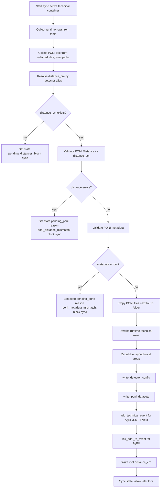
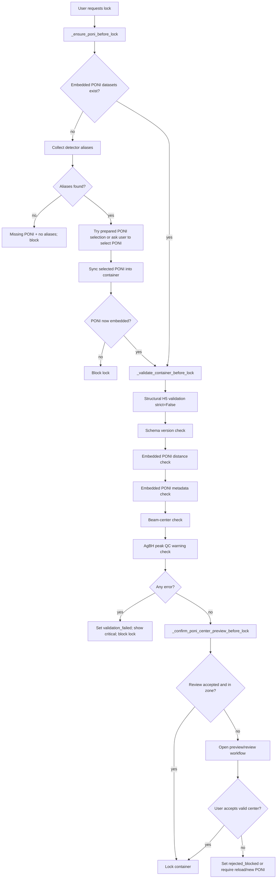

# Technical Container Validation

Документ описывает текущую проверку технического контейнера в DiFRA: когда PONI попадает в H5, как считаются ошибки, что блокирует контейнер, и какая ветвистая логика используется перед lock.

## Где код

- `src/difra/gui/main_window_ext/technical/h5_management_loading_mixin.py`
  - `_sync_active_technical_container_from_table`
  - `_poni_distance_validation_errors`
  - `_poni_metadata_validation_errors`
- `src/difra/gui/main_window_ext/technical/h5_management_locking_mixin.py`
  - `_ensure_poni_before_lock`
  - `_validate_container_before_lock`
  - `_embedded_poni_distance_validation_errors`
  - `_embedded_poni_metadata_validation_errors`
  - `_validate_poni_centers_for_container`
  - `_run_poni_center_review_workflow`
- `src/difra/gui/main_window_ext/technical/poni_center_validation.py`
  - `validate_poni_metadata`
  - `parse_poni_center_px`
  - `validate_poni_centers`
- `src/difra/gui/main_window_ext/technical/poni_distance_validation.py`
  - nominal distance range logic
- `src/difra/gui/main_window_ext/technical/poni_agbh_peak_qc.py`
  - non-blocking AgBH peak alignment warning

## Проверки

### 1. Distance check

PONI distance читается из строки:

```text
Distance: <meters>
```

Перевод:

```text
poni_distance_cm = Distance * 100
```

Ошибка:

```text
deviation_percent = abs(poni_distance_cm - expected_distance_cm) / expected_distance_cm * 100
```

Default hard fail:

```text
deviation_percent > 5.0
```

Configured nominal ranges:

```text
nominal 2 cm:  1.8-3.0 cm allowed
nominal 17 cm: 16.5-18.0 cm allowed
```

This allows real fitted 2 cm PONI values around 2.3-2.5 cm, while still blocking 2 cm/17 cm swaps.

Примеры hard fail:

- 17 cm technical container + 2 cm PONI
- 2 cm technical container + 17 cm PONI
- PONI без читаемого `Distance`
- `distance_cm <= 0`

### 2. Metadata check

Включается через `poni_metadata_validation.enabled`.

Текущая Ulster/Xena логика:

```text
energy = 8.04 keV ± 0.1 keV
pixel size = 55 x 55 um ± 0.25 um
detector shape = 256 x 256 px exactly
```

Energy считается из PONI wavelength:

```text
energy_keV = 12.398419843320026 / (wavelength_m * 1e10)
```

Hard fail:

- PONI energy outside tolerance
- missing wavelength/energy when expected energy configured
- pixel size not 55 x 55 um
- missing pixel size
- detector shape not 256 x 256
- missing detector shape

### 3. Beam-center check

Включается через `poni_center_validation.enabled`.

PONI center in pixels:

```text
row_px = Poni1 / pixel1
col_px = Poni2 / pixel2
```

Default comparison epsilon:

```text
0.75 px
```

Current rules:

```text
PRIMARY:
  row = 128 ± 13 px
  col = 10 ± 10 px
  col <= 20 px

SECONDARY:
  row = 128 ± 13 px
  col > 256 px
```

Hard fail:

- missing PONI content for configured alias
- cannot parse Poni1/Poni2/pixel geometry
- center outside configured allowed zone

### 4. AgBH peak QC

Non-blocking warning only.

It integrates the AgBH technical image with selected/embedded PONI and compares measured peak maxima with theoretical AgBH q positions.

Current limits:

```text
integration bins = 600
peak search window = ±0.20 nm^-1
warning if peak shift > 0.25 nm^-1
minimum checked peaks = 4
PRIMARY q range = 1-18 nm^-1
SECONDARY q range = 4.5-23 nm^-1
```

Result:

```text
IF peaks drift:
    show/log warning
    do not block H5 generation or lock
```

## Sync Into Active Technical H5

Function:

```text
_sync_active_technical_container_from_table(show_errors=True)
```

Flow:



Important rule:

```text
PONI is read from filesystem paths during sync.
If validation fails, PONI is not embedded into technical H5.
```

Stricter current rule:

```text
PONI used for technical H5 sync must come from a path in poni_files.
self.ponis memory cache is ignored for technical H5 embedding.
```

## Before Lock

Function:

```text
_validate_container_before_lock(container_path, container_id)
```

Flow:



## Lock If/Then Cases

### Case A: No embedded PONI

If technical H5 has no `/entry/technical/poni/*` datasets:

```text
IF aliases cannot be determined:
    block lock
ELSE IF selected PONI files already exist:
    sync them
ELSE:
    ask operator to select PONI files

IF sync fails:
    block lock
IF PONI still absent:
    block lock
```

### Case B: Structural validation fails

```text
IF technical validator returns errors:
    block lock
    state = validation_failed
```

Examples:

- malformed H5
- missing required technical groups/datasets
- bad schema version

### Case C: Distance mismatch

```text
IF embedded PONI Distance is outside configured allowed range:
    block lock
    state = validation_failed
```

This catches:

- stale 17 cm PONI inside 2 cm container
- stale 2 cm PONI inside 17 cm container

### Case D: Metadata mismatch

```text
IF PONI metadata != expected detector setup:
    block lock
    state = validation_failed
```

This catches:

- 50 um pixel PONI on Xena
- wrong detector size
- wrong energy/wavelength

### Case E: Beam center outside allowed zone

```text
IF PONI center outside allowed zone:
    show critical validation error
    set state = rejected_blocked
    lock blocked unless password override is accepted
```

If user rejects preview:

```text
state = rejected_blocked
operator can reload PONI
```

If user accepts valid preview:

```text
review state = accepted
state = ready_to_lock
lock allowed
```

## Stored Review Attributes

PONI review result is written into root H5 attrs:

```text
poni_center_review_status
poni_center_review_user
poni_center_review_timestamp
poni_center_in_allowed_zone
poni_center_review_notes
poni_center_review_reason
```

## Failure Severity

| Severity | Condition | Result |
|---|---|---|
| Red | missing distance_cm | sync blocked |
| Red | missing/unreadable PONI | lock blocked |
| Red | PONI distance outside allowed range | sync/lock blocked |
| Red | pixel/energy/shape mismatch | sync/lock blocked |
| Red | beam center outside allowed zone | lock blocked/review required |
| Red | schema version mismatch | lock blocked |
| Orange | AgBH peaks drift from theoretical q lines | warning only |
| Orange | center warnings only | logged, lock can continue |
| Green | all checks pass + review accepted | lock allowed |

## Current Safety Net

Technical container cannot become locked for real measurements unless all are true:

```text
valid H5 structure
correct schema_version
real distance_cm exists
embedded PONI exists
PONI Distance matches technical distance within 5% or configured nominal range
PONI metadata matches detector setup
PONI center is in allowed detector zone or explicitly overridden
AgBH peak QC produces no warning or operator accepts warning
operator preview/review accepted
```
